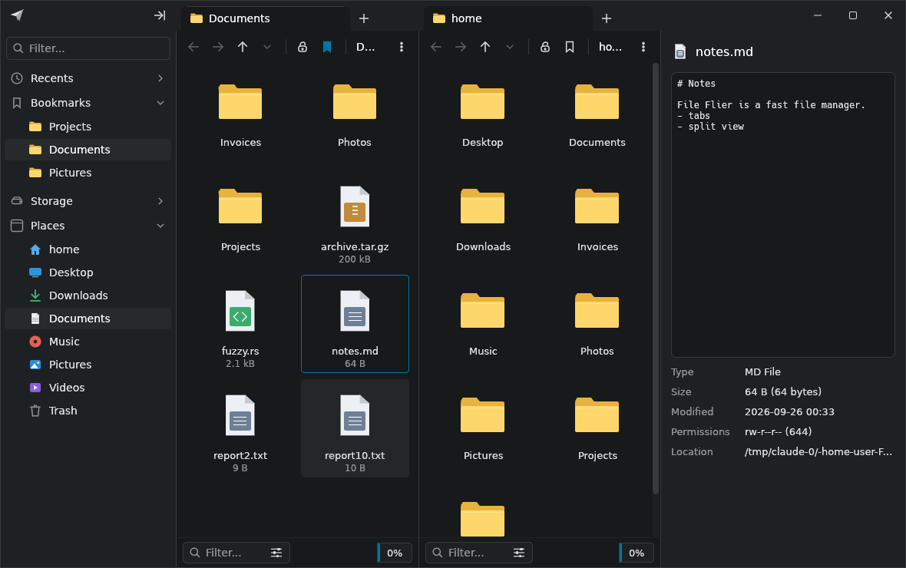

# File Flier

A fast, keyboard-driven file manager for Linux, modeled closely on
[File Pilot](https://filepilot.tech) for Windows. It is written in Rust with
[egui](https://github.com/emilk/egui) and draws all of its own UI, so it looks
the same on every desktop environment.



> This is a fan-made side project and has no connection to File Pilot or its
> author. The UI copies File Pilot's look, but the logo, name and code are
> original.

## Features

- **File Pilot-style window.** Frameless dark UI with browser-style tabs in the
  title bar, custom window buttons, and a light theme.
- **Tabs and split panes.** Each pane has its own tab strip. You can drag tabs
  to reorder them, middle-click to close them, and lock a tab so that opening
  a folder from it creates a new tab.
- **Three views.** Details (Name / Type / Items / Size / Modified), multi-column
  List, and Grid with image thumbnails.
- **Instant filter.** Start typing to fuzzy-filter the current folder. The
  filter also appears in the pane's bottom bar.
- **Recursive search** (`Ctrl+F`). Fuzzy-matches names in every sub-folder on a
  background thread.
- **Command palette** (`Ctrl+Shift+P` / `Ctrl+K`). Runs any command and jumps to
  bookmarks or recent folders.
- **GoTo** (`Ctrl+L`). Path entry with folder autocompletion. `Tab` completes
  the highlighted suggestion.
- **Searchable context menus.** Right-click menus include a search field and
  show each command's shortcut.
- **Inspector** (`F3`). Previews text files, images and folder contents, and
  shows the item's metadata.
- **Sidebar.** Has its own filter box and collapsible sections for Recents,
  Bookmarks, Storage (mounted drives with usage bars) and Places.
- **File operations.** Copy, cut, paste, drag-and-drop (moves within a
  filesystem; hold `Ctrl` to copy), move to trash, permanent delete, rename,
  new file or folder, and copy or move to the other pane (`F5` / `F6`).
  Operations run on a background thread and show progress.
- **System clipboard.** Copied files go to the clipboard as paths. Pasting
  paths or `file://` URIs from other applications copies those files in.
- The view refreshes automatically when a folder changes on disk.

## Keyboard shortcuts

| Keys | Action |
| --- | --- |
| `↑ ↓ PgUp PgDn Home End` | Move the cursor (hold `Shift` to select) |
| `Enter` / `→` | Open |
| `Backspace` / `←` | Parent folder |
| `Alt+←` / `Alt+→` | Back / Forward |
| *type anything* | Filter the current folder (`Esc` clears it) |
| `Ctrl+T` / `Ctrl+W` | New tab / close tab |
| `Ctrl+Tab` | Next tab |
| `Ctrl+\` / `Tab` | Toggle split view / switch pane |
| `Ctrl+Shift+P` or `Ctrl+K` | Command palette |
| `Ctrl+F` | Recursive search |
| `Ctrl+L` | Go to a path |
| `Ctrl+C` / `Ctrl+X` / `Ctrl+V` | Copy / cut / paste |
| `F5` / `F6` | Copy / move to the other pane |
| `F2` | Rename |
| `Delete` / `Shift+Delete` | Move to trash / delete permanently |
| `Ctrl+Shift+N` / `Ctrl+N` | New folder / new file |
| `Ctrl+Shift+D` / `L` / `G` | Details / list / grid view |
| `Ctrl+H` | Show hidden files |
| `Ctrl+B` | Toggle the sidebar |
| `F3` or `Ctrl+I` | Toggle the inspector |
| `Ctrl+D` | Bookmark the current folder |
| `Ctrl+Shift+T` | Open a terminal here |
| `F1` | List all shortcuts |

## Building

You need a recent stable Rust toolchain (edition 2024). You also need the usual
windowing libraries: X11 or Wayland, `libxkbcommon`, and OpenGL.

```sh
# Debian/Ubuntu runtime libraries, if they're missing:
sudo apt install libxkbcommon-x11-0 libgl1 libegl1

cargo run --release              # opens your home folder
cargo run --release -- ~/Projects   # opens a specific folder
```

The release build writes a single binary, `target/release/file-flier`. To add
File Flier to your application launcher, copy that binary somewhere on your
`PATH` and install `assets/file-flier.desktop` into
`~/.local/share/applications/`.

The terminal command opens `$TERMINAL` if it is set. Otherwise it tries common
terminal emulators in turn.

## Configuration

Settings are saved automatically to `~/.config/file-flier/config.json`. They
include bookmarks, recent folders, the theme, the default view, split and
inspector state, the sidebar width and which sections are collapsed, and the
sort order.

## Development

```sh
cargo test
cargo clippy --all-targets -- -D warnings
cargo fmt --check
```

Source layout:

| Path | Contents |
| --- | --- |
| `src/app.rs` | Application state, command dispatch, keyboard handling, layout |
| `src/ui/` | Custom-drawn UI: `chrome` (title bar, tabs, window buttons), `pane_view`, `sidebar`, `inspector`, `popups` |
| `src/theme.rs`, `src/icons.rs` | Color palette and the vector icon set |
| `src/pane.rs` | Tabs, navigation history, selection and filtering |
| `src/fs_model.rs`, `src/ops.rs` | Directory listing and sorting; copy, move, trash and rename |
| `src/search.rs`, `src/fuzzy.rs` | Background recursive search and the fuzzy matcher |
| `src/commands.rs` | Every action and its shortcuts |
