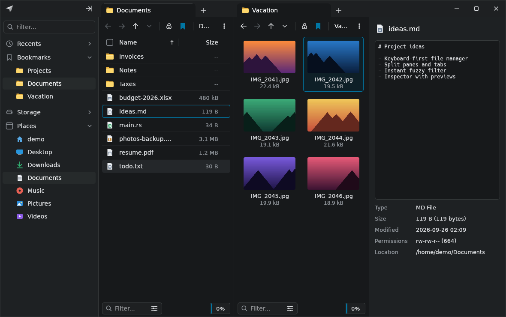
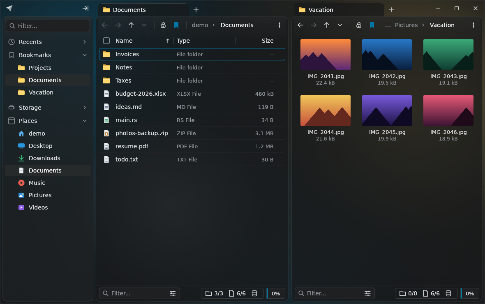

# File Flier

A fast, keyboard-driven file manager for Linux, modeled closely on
[File Pilot](https://filepilot.tech) for Windows. It is written in Rust with
[egui](https://github.com/emilk/egui) and draws all of its own UI, so it looks
the same on every desktop environment.



> This is a fan-made side project and has no connection to File Pilot or its
> author. The UI copies File Pilot's look, but the logo, name and code are
> original.

## Features

- **File Pilot-style window.** Frameless dark UI with browser-style tabs in the
  title bar, custom window buttons, and a light theme.
- **Tabs and split panes.** Each pane has its own tab strip. You can drag tabs
  to reorder them, middle-click to close them, and lock a tab so that opening
  a folder from it creates a new tab.
- **Three views.** Details (Name / Type / Items / Size / Modified), multi-column
  List, and Grid with image thumbnails.
- **Instant filter.** Start typing to fuzzy-filter the current folder. The
  filter also appears in the pane's bottom bar.
- **Recursive search** (`Ctrl+F`). Fuzzy-matches names in every sub-folder on a
  background thread.
- **Command palette** (`Ctrl+Shift+P` / `Ctrl+K`). Runs any command and jumps to
  bookmarks or recent folders.
- **GoTo** (`Ctrl+L`). Path entry with folder autocompletion. `Tab` completes
  the highlighted suggestion.
- **Searchable context menus.** Right-click menus include a search field and
  show each command's shortcut.
- **Preview panel** (`F3`). A Finder-style panel with a large, zoomable
  preview of the selected item and its details. See [Previews](#previews).
- **Sidebar.** Has its own filter box and collapsible sections for Recents,
  Bookmarks, Storage (mounted drives with usage bars) and Places.
- **File operations.** Copy, cut, paste, drag-and-drop (moves within a
  filesystem; hold `Ctrl` to copy), move to trash, permanent delete, rename,
  new file or folder, and copy or move to the other pane (`F5` / `F6`).
  Operations run on a background thread and show progress.
- **System clipboard.** Copied files go to the clipboard as paths. Pasting
  paths or `file://` URIs from other applications copies those files in.
- The view refreshes automatically when a folder changes on disk.

## Previews

Select a file and the preview panel on the right shows it, with an
*Information* section below: kind, size, dates, permissions and type-specific
details such as camera and exposure, duration and codecs, page count, or
author. Drag the panel's left edge to resize it. Scroll or pinch over a picture
to zoom, drag to pan, and double-click to switch between fit and actual size.

| Type | Preview |
| --- | --- |
| Photos and images: JPEG, PNG, GIF, WebP, TIFF, BMP, ICO, TGA, EXR, HDR and more | The image, rotated per EXIF, with camera details and GPS location |
| HEIC, HEIF, AVIF, JPEG XL | The image (through libheif or ffmpeg) |
| SVG | Rendered crisply at any zoom |
| Camera RAW (CR2, CR3, NEF, ARW, DNG, RAF, ORF, RW2...) | The camera's embedded full-size preview |
| PDF | Rendered pages; flip through with the page buttons or `Page Up` / `Page Down` |
| Word, OpenDocument, RTF, `.doc`, PowerPoint | Real pages when LibreOffice is installed; otherwise the text with headings, lists and tables |
| Excel, OpenDocument spreadsheets, CSV | A spreadsheet-style table |
| Video | A frame from the video, plus duration, resolution and codecs (needs ffmpeg, which the Flatpak includes) |
| Audio | Album art, title, artist, album, duration and format |
| EPUB, Pages, Numbers, Keynote, comic books (CBZ) | The cover or stored preview |
| ZIP and tar archives | The files inside |
| Fonts | A type sample |
| Code and text | Syntax-highlighted text |

Grid view (`Ctrl+Shift+G`) shows thumbnails for these types too. Thumbnails are
stored in the shared `~/.cache/thumbnails` folder, so File Flier reuses
thumbnails made by GNOME Files and Dolphin, and they reuse File Flier's.

LibreOffice page previews can be turned off in *Settings → Previews*. The
rendered pages are cached in `~/.cache/file-flier` (at most about 200 MB) so
documents open instantly the next time. In the
Flatpak, they need the same host access as *Open terminal here*, because
LibreOffice runs outside the sandbox.

## Quick Look, rename and undo

- **Quick Look:** press `Space` to preview the selected item in a large window.
  It supports everything the preview panel does, including zoom. Use the arrow
  keys to move to the next item, `+` / `-` / `0` to zoom, `Enter` to open it,
  and `Space` or `Esc` to close the preview.
- **Rename in place:** press `F2` to edit the name directly in the list. The
  name is selected without its extension, so typing replaces just the name.
  `Enter` or clicking elsewhere saves; `Esc` cancels.
- **Undo:** `Ctrl+Z` (or the *Undo* button on the notification) reverts the
  last rename, move, copy, new file or folder, or move to trash. Undoing a copy
  moves the copies to the trash, and undo never overwrites a file. Restoring
  from the trash works on Linux; on macOS, use *Put Back* in Finder.

## Settings

Open Settings with `Ctrl+,`, from the ⋮ menu, or from the command palette.

- **Themes:** File Pilot Dark (default), Light, Midnight (true black, good for
  OLED screens), Nord, Dracula, Catppuccin Mocha, Gruvbox and Solarized Light.
- **Accent color:** the theme's own, or one of eight colors. Text on the accent
  switches between black and white so it stays readable.
- **Interface size:** 80–150%. You can also press `Ctrl +`, `Ctrl −` and
  `Ctrl 0`.
- **Row density:** compact, comfortable or spacious.
- **Default view** for new tabs.
- **Browsing:** show hidden files, folders first, and item counts (turn these
  off if network drives feel slow).
- **Dates:** `2026-09-26 14:03`, "5 min ago" or `Sep 26, 2026`.
- **Startup:** open your home folder, or restore last session's tabs and split
  panes.
- **Animations:** smooth transitions for the selection highlight, scrolling,
  folders, menus, Quick Look and notifications. Turn them off to make
  everything instant.
- **Frosted glass:** panels become translucent and float over a soft color
  backdrop, with a choice of strength (Airy to Solid). With **Show desktop
  behind window**, your wallpaper shows through, blurred, on KDE Plasma
  (including Bazzite) and macOS. *Auto* turns this on only on those systems;
  elsewhere, such as Cinnamon on Linux Mint, the desktop would show through
  unblurred. Changing this option takes effect after a restart.



## Keyboard shortcuts

| Keys | Action |
| --- | --- |
| `↑ ↓ PgUp PgDn Home End` | Move the cursor (hold `Shift` to select) |
| `Enter` / `→` | Open |
| `Backspace` / `←` | Parent folder |
| `Alt+←` / `Alt+→` | Back / Forward |
| *type anything* | Filter the current folder (`Esc` clears it) |
| `Ctrl+T` / `Ctrl+W` | New tab / close tab |
| `Ctrl+Tab` | Next tab |
| `Ctrl+\` / `Tab` | Toggle split view / switch pane |
| `Ctrl+Shift+P` or `Ctrl+K` | Command palette |
| `Ctrl+F` | Recursive search |
| `Ctrl+L` | Go to a path |
| `Ctrl+C` / `Ctrl+X` / `Ctrl+V` | Copy / cut / paste |
| `F5` / `F6` | Copy / move to the other pane |
| `F2` | Rename |
| `Delete` / `Shift+Delete` | Move to trash / delete permanently |
| `Ctrl+Shift+N` / `Ctrl+N` | New folder / new file |
| `Ctrl+Shift+D` / `L` / `G` | Details / list / grid view |
| `Ctrl+H` | Show hidden files |
| `Ctrl+B` | Toggle the sidebar |
| `F3` or `Ctrl+I` | Toggle the preview panel |
| `Ctrl+D` | Bookmark the current folder |
| `Ctrl+Shift+T` | Open a terminal here |
| `Space` | Quick Look |
| `Ctrl+Z` | Undo |
| `Ctrl+,` | Settings |
| `Ctrl +` / `Ctrl −` / `Ctrl 0` | Interface size |
| `F1` | List all shortcuts |

## Installing

### Bazzite, Silverblue, SteamOS and other immutable distros

On these systems the OS is read-only, so File Flier installs as a **Flatpak**.
Nothing is layered onto the system and nothing needs root.

**From a release:** download `file-flier.flatpak` from the
[Releases](https://github.com/andrew11155/FileFlier/releases) page, or from the
latest *Release* workflow run under Actions, then run:

```sh
flatpak install --user file-flier.flatpak
```

**From source:**

```sh
git clone https://github.com/andrew11155/FileFlier.git
cd FileFlier
./install.sh
```

`install.sh` builds the Flatpak and installs it for your user. If
`flatpak-builder` isn't installed (it isn't on Bazzite), the script fetches
Flathub's `org.flatpak.Builder` first. The script only needs `flatpak`, which
every immutable desktop ships.

Afterwards, launch **File Flier** from your app menu, or run
`flatpak run io.github.andrew11155.FileFlier`. To remove it, run
`./install.sh --uninstall` or `flatpak uninstall io.github.andrew11155.FileFlier`.

The Flatpak has these sandbox permissions:
- **Your files** (`--filesystem=host`): your home folder, drives under
  `/run/media` and `/mnt`, and the real trash in `~/.local/share/Trash`, so
  deleted files show up in your desktop's trash.
- **Network shares mounted by GNOME** (`xdg-run/gvfs`): see
  [Network shares and cloud storage](#network-shares-and-cloud-storage).

*Open terminal here* needs one more permission, which lets the app start your
terminal outside the sandbox. It's off by default because it effectively
bypasses the sandbox. `install.sh` turns it on for you. If you installed the
Flatpak another way, the app copies the command to enable it when you first use
the feature:

```sh
flatpak override --user --talk-name=org.freedesktop.Flatpak io.github.andrew11155.FileFlier
```

### Without Flatpak (binary in `~/.local`)

`./install.sh --native` installs a plain binary into `~/.local/bin` and adds a
menu entry. It never touches `/usr`, so it also works on immutable systems.

- **From a release tarball** (`file-flier-x86_64-linux.tar.gz`): extract it and
  run `./install.sh`. This uses the prebuilt binary.
- **From source:** you need Rust and a C compiler. On Bazzite, build inside a
  distrobox; it shares your home folder, so the result installs on the host:

  ```sh
  distrobox create -n build -i registry.fedoraproject.org/fedora:latest
  distrobox enter build -- sh -c 'sudo dnf install -y cargo gcc && ./install.sh --native'
  ```

## Building

You need a recent stable Rust toolchain (edition 2024). You also need the usual
windowing libraries: X11 or Wayland, `libxkbcommon`, and OpenGL.

```sh
# Debian/Ubuntu runtime libraries, if they're missing:
sudo apt install libxkbcommon-x11-0 libgl1 libegl1

cargo run --release              # opens your home folder
cargo run --release -- ~/Projects   # opens a specific folder
```

The terminal command opens `$TERMINAL` if it is set. Otherwise it tries common
terminal emulators in turn.

### Packaging

- `flatpak/io.github.andrew11155.FileFlier.yml` is the Flatpak manifest. It
  builds offline: crates come from `flatpak/cargo-sources.json` rather than
  being downloaded during the build, which is also what Flathub requires.
- **Whenever `Cargo.lock` changes**, regenerate that file (CI fails if it's
  stale):

  ```sh
  pip install aiohttp tomlkit
  curl -O https://raw.githubusercontent.com/flatpak/flatpak-builder-tools/master/cargo/flatpak-cargo-generator.py
  python3 flatpak-cargo-generator.py Cargo.lock -o flatpak/cargo-sources.json
  ```
- Publishing on Flathub is described step by step in
  [docs/FLATHUB.md](docs/FLATHUB.md).
- Pushing a tag such as `v0.1.0` runs the *Release* workflow. It attaches
  `file-flier.flatpak` and `file-flier-x86_64-linux.tar.gz` to a GitHub release.
  You can also run the workflow by hand from the Actions tab.

## Network shares and cloud storage

File Flier works with anything that is mounted as a folder. Drives, network
shares and cloud mounts appear under **Storage** in the sidebar.

| What | How to connect it | Works in File Flier |
| --- | --- | --- |
| NAS or server (SMB/Samba, NFS) | Mount it with `/etc/fstab` or a systemd mount, e.g. under `/mnt/nas` | ✅ Listed under Storage |
| Shares opened in GNOME Files (`smb://`, `sftp://`) | GNOME mounts them under `/run/user/<id>/gvfs` | ✅ Listed with a friendly name, e.g. "media on nas". You can also type `smb://nas/media` into Go To (`Ctrl+L`). |
| Google Drive via GNOME Online Accounts | GNOME mounts it the same way | ✅ Listed as "Google Drive (you)" |
| OneDrive, Google Drive, Dropbox and more | [`rclone mount`](https://rclone.org/commands/rclone_mount/), or the [`onedrive`](https://github.com/abraunegg/onedrive) sync client | ✅ rclone mounts appear under Storage; synced folders are normal folders |
| Shares opened in KDE Dolphin (`smb://` in KIO) | KIO doesn't expose shares as real folders | ❌ Mount the share with fstab or rclone instead |

When you type an `smb://` address that isn't mounted yet, the native build asks
GNOME to mount it (`gio mount`). This works for guest shares and for shares
whose password your desktop keyring already has. Password-protected shares
need to be opened once in your desktop's file manager first. File Flier doesn't
store passwords.

Folders on network and cloud mounts don't auto-refresh (press `Ctrl+R`), and
their item counts load in the background. A slow or disconnected server can't
freeze the window.

## Security

- **No network access.** File Flier sends nothing anywhere: no telemetry, no
  update checks, no accounts.
- **It never runs code from your files.** Opening a file hands it to your
  default application, like any file manager.
- **File operations never overwrite by accident.** Copy, move and rename use the
  kernel's atomic no-replace operations. Symlinks are copied as links, never
  followed. Copying a folder into itself is refused, even through a symlink.
  Special files (pipes, sockets, devices) are never read, because reading them
  can block forever.
- **Previews are isolated.** File formats are decoded by memory-safe Rust code,
  except HEIC (libheif) and PDF, which are decoded in a separate short-lived
  helper process, so a malformed file can't crash or hang File Flier.
- **Deleting is recoverable by default.** `Delete` moves items to the trash.
  Permanent delete (`Shift+Delete`) asks first.
- **The Flatpak sandbox is broad by necessity.** A file manager needs access to
  your files, so the sandbox doesn't isolate File Flier from your data. The one
  permission that would let it run commands outside the sandbox is opt-in.

This is young software and hasn't been independently audited. Keep backups, as
you would with any new tool that moves files around. Please report security
issues privately; see [SECURITY.md](SECURITY.md).

## Configuration

Settings are saved automatically to `~/.config/file-flier/config.json`. They
include bookmarks, recent folders, the theme, the default view, split and
inspector state, the sidebar width and which sections are collapsed, and the
sort order.

## Development

```sh
cargo test
cargo clippy --all-targets -- -D warnings
cargo fmt --check
```

Source layout:

| Path | Contents |
| --- | --- |
| `src/app.rs` | Application state, command dispatch, keyboard handling, layout |
| `src/ui/` | Custom-drawn UI: `chrome` (title bar, tabs, window buttons), `pane_view`, `sidebar`, `inspector`, `preview_view`, `quicklook`, `popups` |
| `src/preview/` | Preview and thumbnail loading: images, documents, media, archives, the helper process and the thumbnail cache |
| `src/theme.rs`, `src/icons.rs` | Color palette and the vector icon set |
| `src/pane.rs` | Tabs, navigation history, selection and filtering |
| `src/fs_model.rs`, `src/ops.rs` | Directory listing and sorting; copy, move, trash and rename |
| `src/search.rs`, `src/fuzzy.rs` | Background recursive search and the fuzzy matcher |
| `src/mounts.rs`, `src/counts.rs` | Drive, network share and cloud mount discovery; background folder item counts |
| `src/commands.rs` | Every action and its shortcuts |

## License

File Flier is free software, licensed under the
[GNU General Public License v3.0 or later](LICENSE). You may use, study, share
and modify it. If you distribute a modified version, you must also make its
source available under the same license.
